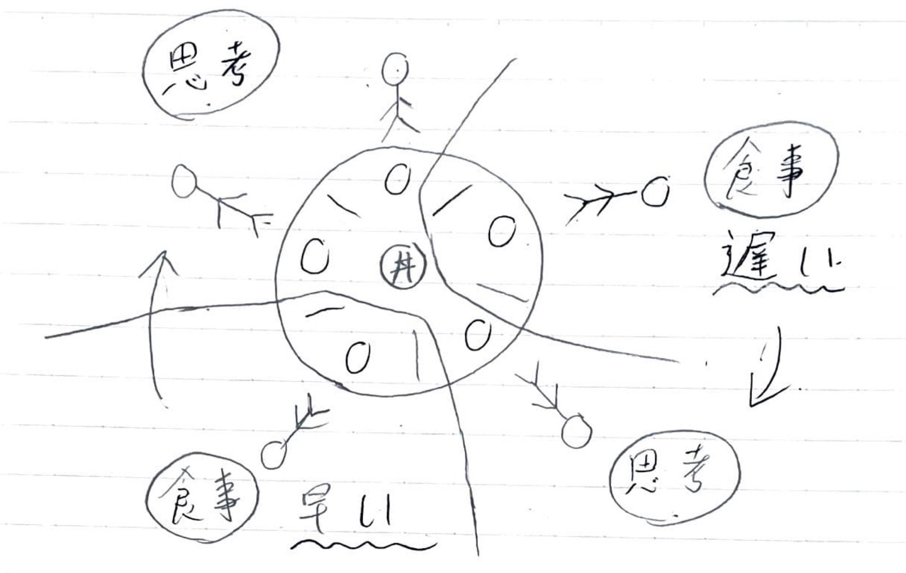
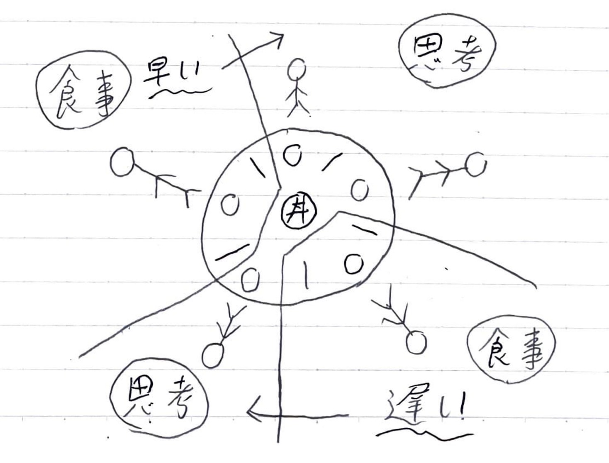

<ol>
  <li>サーバーの接続状況を示すアイコン 
   
  上側が接続時のアイコン、下側が未接続時のアイコン</li> 
  
  <li>時間帯を示すアイコン 
  
  <ul>
    <li>午前中の時間帯(6時~12時)はオレンジ色に光る太陽のアイコン</li>
    <li>お昼の時間帯(12時~13時)は青色の弁当のアイコン</li>
    <li>昼過ぎの時間帯(13時~18時)は灰色の雲のアイコン</li>
    <li>夜の時間帯(18時~0時)は紫色の月のアイコン</li>
    <li>深夜の時間帯(0時~6時)は赤の月のアイコン</li>
  </ul>
  </li>
</ol>
